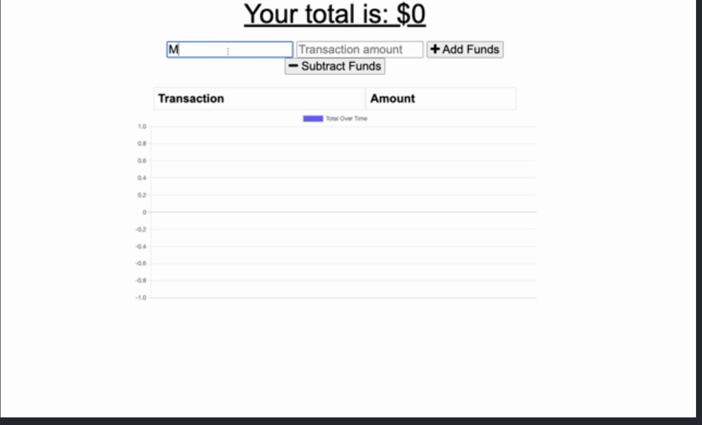

# Progressive-Budget
- Code : [Code](git@github.com:Nahid1010/Progressive-Budget.git)

You can clone code from github link and run it locally on your computer.

##### Deployed

This application is deployed at this link on heroku.

##### Prerequisites

A computer with `mongodb` database installed locally, `node.js` and npm (node package manager). It uses following `node.js` packages -

- dotenv
- express
- mongoose
- Node.js
To clone code from github, you need to have aceess to the Internet.

##### Installing and running

Open a terminal.
Create a directory for this project.
Change current directory to this project direcory.
Issue the following command -
git:`git@github.com:Nahid1010/Progressive-Budget.git`
If you don't have `node.js`installed already then download it.
Once installed, use npm to install node packages listed above by - issuing `npm i` command at the terminal prompt.
 ###### sample

 ##### Contacts

- Github

  Nahid101

